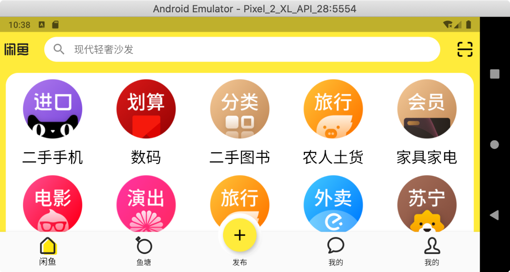
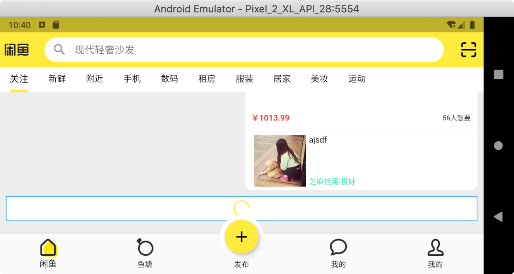

# xianyu

A new Flutter project.

## Getting Started

This project is a starting point for a Flutter application.

A few resources to get you started if this is your first Flutter project:

- [Lab: Write your first Flutter app](https://flutter.dev/docs/get-started/codelab)
- [Cookbook: Useful Flutter samples](https://flutter.dev/docs/cookbook)

For help getting started with Flutter, view our
[online documentation](https://flutter.dev/docs), which offers tutorials,
samples, guidance on mobile development, and a full API reference.

# 闲鱼功能介绍

## 项目功能截图

<table>
    <tr>
    	 <td> 
图片演示</img>
 </td> 
    	 <td> 
图片演示</img>
 </td> 
    	 <td> 
图片演示</img>
 </td> 
    </tr>
    <tr>
    	 <td> 
横屏演示</img>
 </td>
       <td> 
横屏演示</img>
 </td>
       <td> 
横屏演示</img>
 </td> 
    </tr>
</table>

## 接口数据

1. 接口数据使用 

    [闲鱼服务器工程](https://github.com/pan372728544/nodeTest)

2. 使用
   进入服务器功能，运行 node xianyu.js 开启服务器。
   

